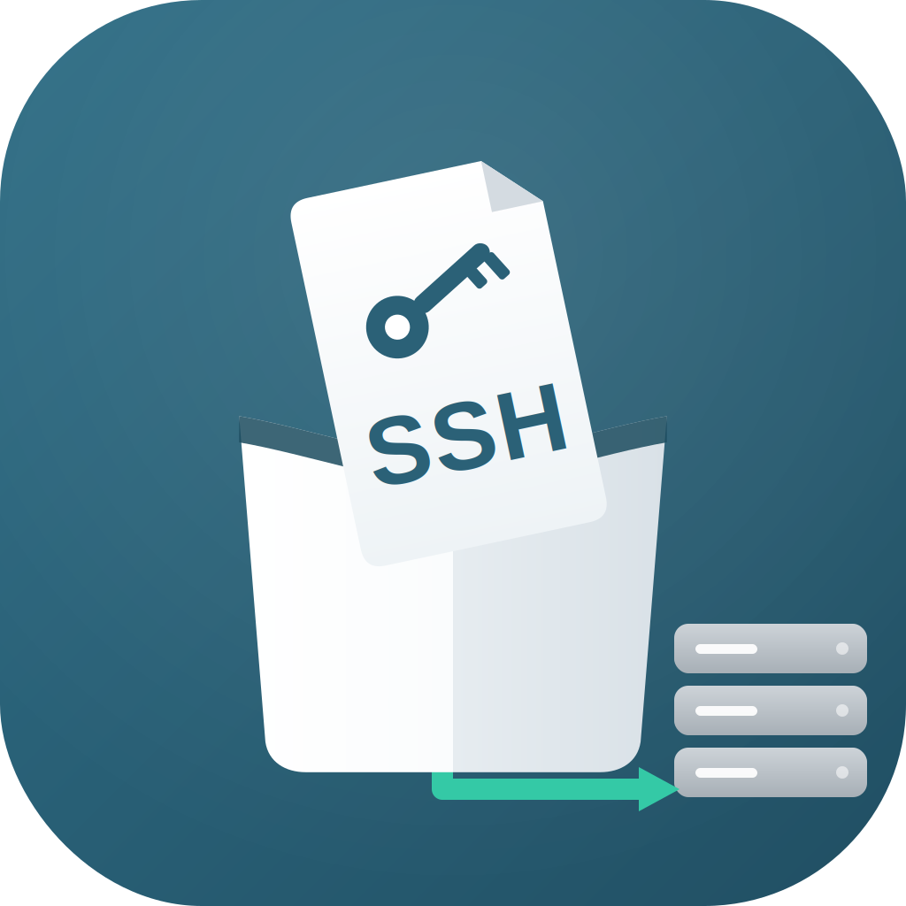

  

# SSH Drop

macOS menu utility to push files, folders, or clipboard content to a remote host over SSH. Drop something (on the window or the Dock icon), or paste content, and it lands on the host under a dated folder — with the resulting remote path copied back to your clipboard.

## Features

- **Drop files or folders** — on the window or the Dock icon, app running or not. Accepts any type; folders are copied recursively (`scp -r`).
- **Paste** — via the Paste button or `⌘V`. Pasted/dropped image data is saved (PNG); text becomes `.txt`/`.rtf`.
- **Naming** — `<path>/<DD-MM-YYYY>/<name>_<timestamp>.<ext>` (folders keep their name, no extension split). Same-batch collisions get a `_2`, `_3` suffix.
- **Result to clipboard** — remote absolute path(s) copied after upload, newline-separated.
- **Persistence** — last host and path are remembered.
- **Fast** — SSH connection multiplexing + pre-warming, so transfers start instantly instead of paying a handshake per drop.

## Requirements

- macOS 15.7+
- Passwordless SSH already configured (keys + `~/.ssh/config`). The host field accepts an alias or `user@host` and is passed directly to `ssh`/`scp`.

## Usage

1. Build and run in Xcode (scheme **SSH Drop**), or `xcodebuild -scheme "SSH Drop" build`.
2. Enter **Host** (e.g. an `~/.ssh/config` alias) and **Path** (e.g. `/Users/you/inbox`).
3. Drop files or folders, drop on the Dock icon, or paste. The transfer log shows progress and the final remote path.

## How it works

- Transfers shell out to `/usr/bin/ssh` and `/usr/bin/scp` with `BatchMode=yes` (fails fast, never hangs on a password prompt) and `ControlMaster`/`ControlPersist` for connection reuse.
- The remote date folder is created with `ssh … mkdir -p`, then the item is sent with `scp` (`-r` for folders).
- App Sandbox is disabled so the app can run `ssh`/`scp` and use your existing keys.

## Project layout

| File | Role |
| --- | --- |
| `SSH_DropApp.swift` | App entry, single `Window` scene, delegate adaptor |
| `AppDelegate.swift` | Dock-icon / open-file handling; `trace()` debug logger |
| `ContentView.swift` | UI, AppKit drop target, `⌘V` catcher |
| `TransferManager.swift` | State, queue, naming, upload orchestration |
| `SSHRunner.swift` | `ssh`/`scp` process wrappers, multiplexing, pre-warm |
| `PasteboardReader.swift` | Reads clipboard / drag pasteboard, infers filename + type |
| `Info.plist` | Declares document types so any file can be dropped on the Dock |
